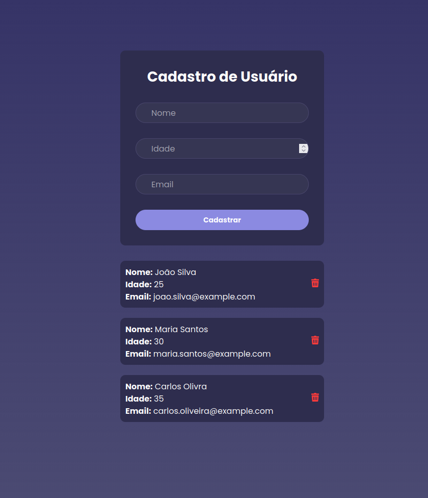

# Form - Cadastro de Usuários

### Backend


### Frontend


## Project Description

**cadastro-usuarios** is a simple full-stack application developed to practice modern web development concepts and technologies. The project demonstrates how a frontend application communicates with a backend API to perform basic **CRUD operations** on a user database.

The system allows users to be **created, listed, and deleted** through a web interface.

This project was built as part of my **software development portfolio** to demonstrate skills in **frontend development, backend API design, and database integration**.

---

# Application Preview



---

# Project Structure

```
cadastro-usuarios
├── backend
│ ├── src/main/java
│ ├── src/main/resources
│ └── pom.xml
│
├── frontend
│ ├── src
│ ├── public
│ └── package.json
│
└── README.md
```
---

# Features

The application provides the following functionality:

- Register a new user through a form
- Retrieve and display the list of users stored in the database
- Delete users from the database
- Communication between frontend and backend through HTTP requests

Each user record contains:

- **Id**
- **Name**
- **Age**
- **Email**

---

# Architecture Overview

The application follows a **client-server architecture**.

```
Frontend (React + TypeScript)
│
│ HTTP Requests (Axios)
▼
Backend API (Spring Boot)
│
▼
PostgreSQL Database
```

The frontend sends HTTP requests to the backend API, which processes the requests and interacts with the PostgreSQL database.

---

# Frontend

The frontend was built using modern JavaScript tooling and frameworks.

## Technologies

- **Vite** – fast development build tool
- **React** – UI library
- **TypeScript** – static typing for JavaScript
- **Axios** – HTTP client for API requests

## Responsibilities

The frontend application:

- Displays a form to register new users
- Sends **POST** requests to create users
- Sends **GET** requests to retrieve the user list
- Sends **DELETE** requests to remove users
- Dynamically updates the UI with the data returned from the backend

---

# Backend

The backend is a **REST API** responsible for handling requests from the frontend and managing database operations.

## Technologies

- **Java**
- **Spring Boot**
- **Tomcat** (embedded server)
- **PostgreSQL**
- **Flyway** for database migrations

## Responsibilities

The backend:

- Exposes REST endpoints for user operations
- Receives and processes HTTP requests from the frontend
- Persists user data in the PostgreSQL database
- Executes database migrations using Flyway

---

# API Endpoints

| Method | Endpoint | Description |
|------|------|------|
| GET | `/users` | Retrieve all users |
| POST | `/users` | Create a new user |
| DELETE | `/users/{id}` | Delete a user |

---

# Database

The application uses **PostgreSQL** as the relational database.

Database schema migrations are managed with **Flyway**, ensuring **version-controlled and reproducible database changes**.

---

# Running the Project

This project currently runs **locally on the development machine**.

Typical workflow:

1. Start the PostgreSQL database
2. Run the Spring Boot backend
3. Start the Vite frontend development server
4. Access the application through the browser

---

# Purpose of the Project

This project was developed to practice and demonstrate:

- Full-stack application development
- REST API design
- Frontend–backend communication
- Database integration
- Modern JavaScript tooling
- Backend development with Spring Boot

# Author

Developed by **Joabe Barbosa**

### 🤝 Conecte-se comigo:

[](https://www.linkedin.com/in/joabe-barbosa-64636b1a8/) 

[](https://www.instagram.com/quant_code/)
